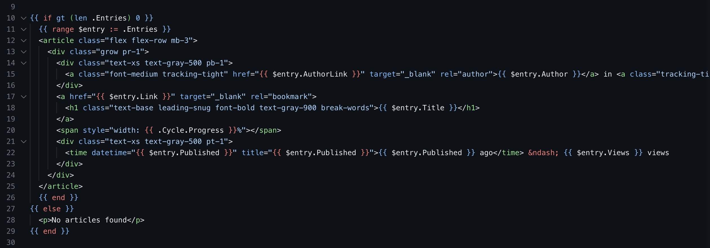

# Go template syntax highlighting

[VS Code extension](https://marketplace.visualstudio.com/items?itemName=romantomjak.go-template) to add syntax highlighting for [Go template files](https://pkg.go.dev/text/template).

## Features

- Multiple supported file extensions - `*.tmpl`, `*.gohtml` and `*.tpl`
- Support for Go templates in string literals
- HTML, JavaScript and CSS tag syntax highlighting
- Syntax highlighting in HTML attributes - `href="{{ .Link }}"`, `style="width: {{ .Width }}%"`

## Known issues

- Syntax highlighting does not (yet) work in `<script>` and `<style>` HTML elements

## Contributing

If you are interested in fixing a bug or contributing a feature, please file an issue first. Wait for a project maintainer to respond before you spend time coding. If you have any other ideas or suggestions, just open an issue and share your thoughts.

If you wish to work on an existing issue, please leave a comment saying so, as someone may already be working on it.

## Development

* Press `F5` to open a new window with the extension loaded
* Create a new file with a file name suffix matching the language
* Verify that syntax highlighting works and that the language configuration settings are working
* Reload (`Ctrl+R` or `Cmd+R` on Mac) the VS Code window with your extension to load your changes

## License

MIT
